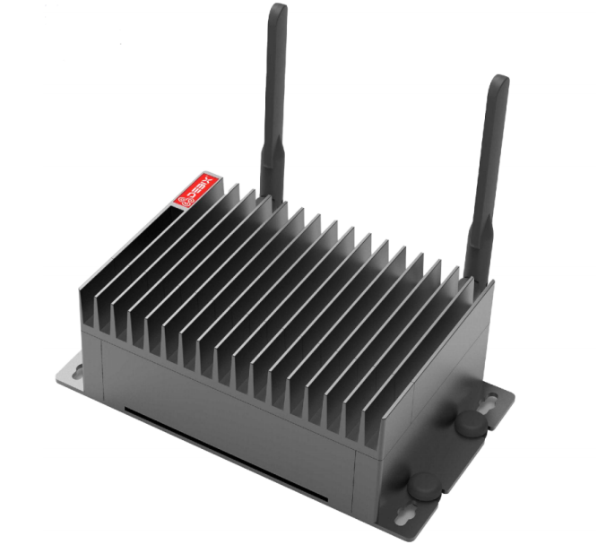
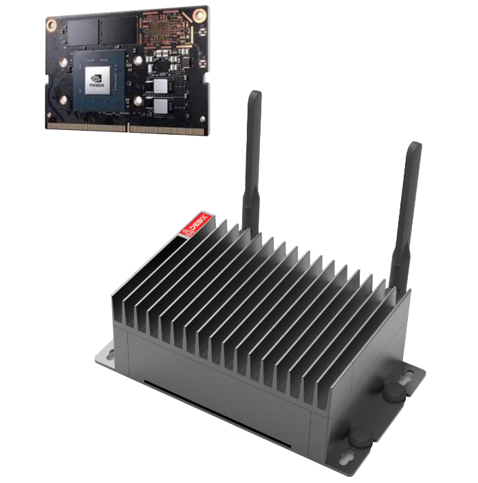

# BPC-EA-100 NVIDIA Jetson Series Edge AI Computing
 

## Overview
The BPC-EA-100, powered by NVIDIA Jetson Series, is an industrial-grade ultra-compact embedded system engineered for edge AI deployments. Specifically designed to address computational constraints, this ruggedized solution delivers efficient AI processing for security surweillance systems, industrial automation platforms, and mobile robotics applications.

## Specification
| System  |             |
|----------|-----------------|
| CPU             | NVIDIA Jetson Nano Module, 4 x ARM Cortex-A57 MPCore processor. The PWR consumption is 5W/10W. |
| Memory          | Onboard 4GB LPDDR4 |
| Storage         | Onboard 16GB eMMC  |
| OS              | Linux OS |
|**Communication**|               
| Gigabit Ethernet | 1 x Gigabit Ethernet port |
|**I/O**|  
|  | 1 x Micro HDMI |
|  | 2 x MIPI |
|  | 1 x USB3.0 Type-C |
|  | 1 x USB2.0 OTG |
|  | 1 x Micro SD slot |
|  | 1 x WiFi Module Support |
|**Power Supply**|
| Power Input | DC 5V, USB Type-C |
| Dimension   | 122mm(W) x 65.5mm(H) x 43mm(D) (±0.5mm) (I/O ports and mounting holes excluded) |
| Operating Temp. | -20℃~+65℃ CPU/GPU Full Loaded Operation; -20℃~+75℃ Frequency Reduction Operation  |
| Storage Temp. | -40℃ to +80℃ |

## Safety Instructions:
***To aviod malfunction or damage to this product please observe the following:*** 
- Disconnect the device from the DC power supply before cleaning. Use a rag. Do not use liquid 
detergents or spray-on detergents.
- Keep the device away from moisture.
- During installation, put the device on a reliable table. It will be damaged if you drop it.
- Before connecting the power supply, ensure that the voltage is in the required range.
- Put the power cable in place to avoid stepping on it
- If the device is not used for a long time, power it off to avoid damage caused by sudden overvoltage.
- Do not pour liquid into the hold of the enclosure, as this could cause fire or electrocution.
- For safety reasons, the device can only be disassembled by professional personnel.
- Do not place the device outside the specified ambient temperature range. This will damage the machine. It needs to be kept in an environment at controlled temperature.

## Contact Us
- **Headquarters**: DEBIX Technology Inc., 8345 Gold River Ct., Las Vegas, NV 89113, USA  
- **Factory**: 5-6/F., East Zone, Shunheda A2 Building, Liqxiandong Industrial Park, XiLi, Nanshan Dist., Shenzhen, China 
- **Email**: info@debix.io  
- **Website**: [www.debix.io](https://www.debix.io)  
- **Community**: [Discord](https://discord.com/invite/adaHHaDkH2)

